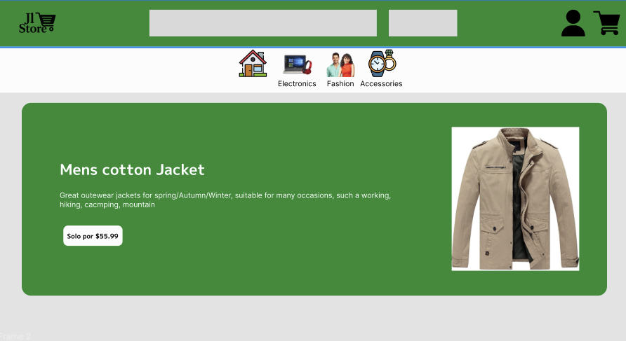

# Proyecto JL Store

JL Store es una aplicación para la gestión de una tienda en línea, desarrollada con el objetivo de facilitar la administración de productos, usuarios y ventas.


## 🌐 Demo en línea
Puedes ver el portafolio publicado en GitHub Pages aquí:
👉 https://jefersonlopezr.github.io/Proyecto-Jl-Store/

## Maquetación en Figma


Se realizó la maquetación del proyecto con la herramienta figma, donde ahí se plasmó los diseños completos y funcionales que son ejecutadas en el proyecto final.

A continuación el link de figma y su maquetación completa:

[Link de Figma](https://www.figma.com/design/t2dGIwFt9ovp2mmRHpiz4O/Untitled?node-id=0-1&p=f&t=9PtPYGgMRSnSFpZO-0)

## Características principales

- Gestión de productos: permite agregar, editar y eliminar productos de la tienda.
- Administración de usuarios: registro, inicio de sesión y gestión de perfiles.
- Control de ventas: seguimiento de pedidos y ventas realizadas.
- Interfaz intuitiva y responsiva, adaptada a dispositivos móviles y escritorio.
- Visualización de estadísticas básicas de ventas y productos.
- Integración con maquetación en Figma para mantener coherencia visual.
- Código modular y organizado para facilitar el mantenimiento y escalabilidad.
- Uso de tecnologías web estándar: HTML, CSS y JavaScript.
- Fácil despliegue y configuración para nuevos usuarios.
- Documentación clara para instalación y contribución.

## 📁 Estructura del Proyecto

ICONS/
main.js/
index.html
ReadMe.md  
styles.css   

## Instalación

1. Clona el repositorio:
    ```bash
    git clone https://github.com/tu-usuario/League-Of-Legends-2.git
    ```
2. Accede al directorio del proyecto:
    ```bash
    cd League-Of-Legends-2
    ```
3. Instala las dependencias necesarias según la tecnología utilizada (ver sección _Tecnologías_).
4. Configura las variables de entorno si es necesario (ver archivo `.env.example`).
5. Sigue las instrucciones específicas de instalación y ejecución según la plataforma (ver sección _Uso_).


## Tecnologías
- **Lenguaje principal**: JavaScript
- **Estilos**: CSS
- **Estructura**: HTML


## Contribución

¡Las contribuciones son bienvenidas! Para colaborar:

1. Haz un fork del repositorio.
2. Crea una rama para tu feature o fix (`git checkout -b feature/nueva-funcionalidad`).
3. Realiza tus cambios y haz commit con mensajes descriptivos.
4. Asegúrate de que tu código pase las pruebas y sigue las guías de estilo del proyecto.
5. Envía un pull request detallando los cambios realizados.


## Créditos

Este proyeto se realizó con inspiración propia, tanto en su diseño y paleta de colores. Cabe resaltar que este proyecto es únicamente con fines educativos y de aprendizaje. Todos los nombres, marcas y recursos utilizados pertenecen a la correspondiente página y API de donde fue seleccionada la información.


## 📝 Notas

- Este proyecto tiene como único propósito servir para fines educativos y de aprendizaje.

---

## 👨‍💻 Autor

- **Jeferson Lopez** - [@jefersonperez](https://github.com/Jefersonlopezr)

## Recursos adicionales

- [Documentación oficial de API Fakestore](https://fakestoreapi.com/products)


📐 Decisiones de diseño y experiencia de usuario
En el desarrollo de JL Store se priorizó una interfaz clara, intuitiva y moderna, basada en principios de usabilidad y accesibilidad. Algunas decisiones clave fueron:

- Diseño responsivo: se adapta a diferentes tamaños de pantalla, desde móviles hasta escritorios, garantizando una experiencia coherente.

- Navegación icónica: se implementaron íconos visuales y texto en la barra de navegación para facilitar el reconocimiento y acceso rápido a cada sección.

- Modal de compra mejorado: el proceso de pago incluye selección de método, resumen detallado y campos de envío organizados, brindando confianza y realismo al usuario.

- Notificaciones visuales: se muestran alertas animadas al agregar productos al carrito, eliminarlos o completar una compra, reforzando el feedback inmediato.


🗂️ Estructura de datos
La aplicación utiliza localStorage para mantener persistencia entre sesiones del navegador. Las estructuras de datos clave son:

- Carrito de compras (cart): se representa como un array de objetos con las propiedades:

js
Copiar
Editar
{
  id, title, price, image, category, quantity
}

- Esto permite un manejo flexible de cada producto y sus cantidades en el carrito.

- Historial de compras (orderHistory): almacena un array de objetos con los pedidos realizados, incluyendo fecha, método de pago, total y detalles de productos.

- Usuarios registrados (usuarios): los datos del formulario de registro se guardan como objetos en un array, conteniendo nombre, email, password, y fechaRegistro.

- Productos: los datos se obtienen desde FakeStore API y se procesan dinámicamente para renderizar la tienda, carruseles y filtros.

🧭 Justificación de filtros y ordenamientos
Desde el enfoque de usabilidad, se implementaron filtros clave para mejorar la experiencia de compra:

- Filtro por categoría: permite acceder rápidamente a productos de interés como ropa, electrónicos o accesorios, reduciendo la sobrecarga cognitiva.

- Rango de precio: el control deslizante ofrece una forma visual y sencilla de limitar resultados sin necesidad de escribir valores.

- Filtro por calificación: brinda a los usuarios la opción de priorizar productos mejor valorados, facilitando la toma de decisiones.

- Búsqueda en tiempo real: permite encontrar productos específicos mediante palabras clave, agilizando el proceso de descubrimiento.